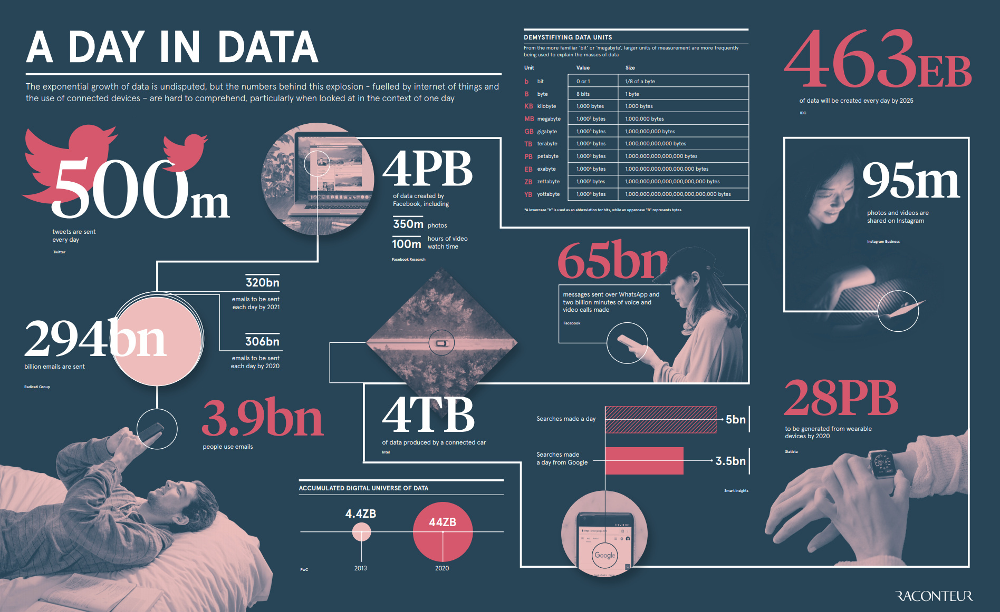
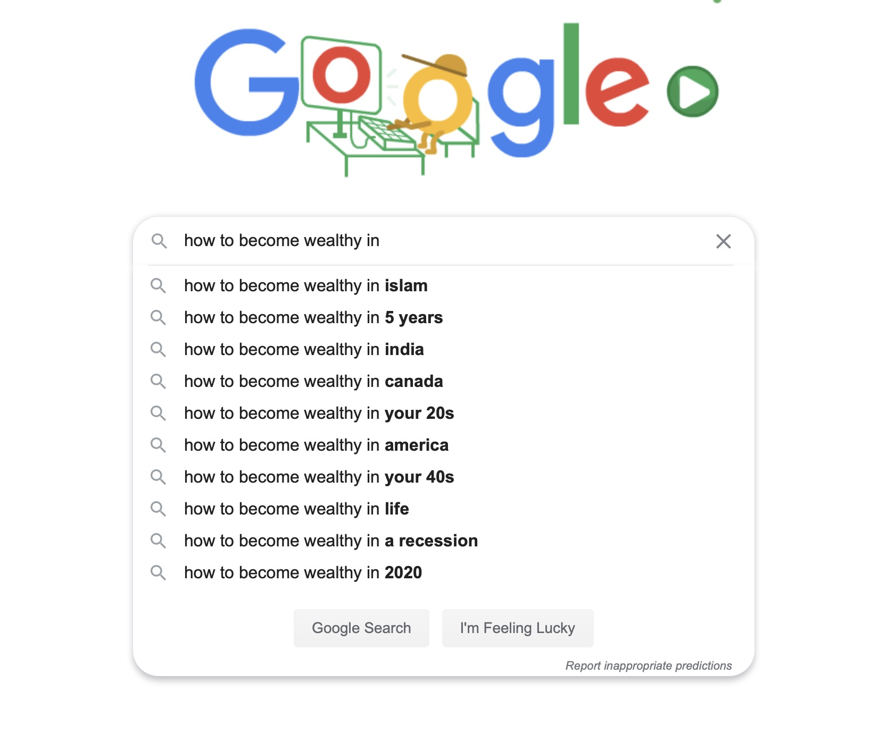
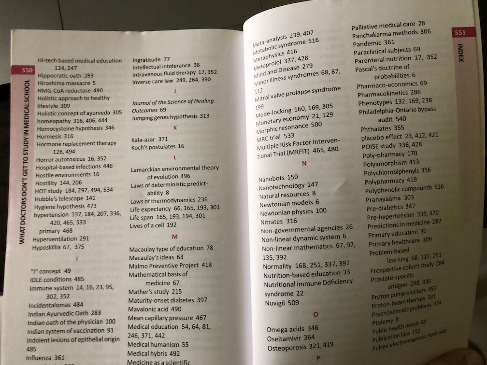

# Why does Gmail take longer the older mails to search my inbox than Google takes to search the entire web
  
  
  
Let's understand the problem. My Gmail account contains say 5GB of data. And the web contains very massive data.  
  
When I searched for: BM Hegde, the google show that, it took 0.42 secs  
> About 13,80,000 results (0.42 seconds) 
  
When I search for my Gmail. The first time it took time. The following searches were faster. But feels like slower than the google search, in many instances.  
  
Both in Google search and in our email, suggestions are shown as we type the query. For example, the googles show the auto-suggestions like this  
  

  
I did these observations on my laptop with high bandwidth. Now when you search with low bandwidth, the difference between Google search and Gmail search is drastic. 

The primary thing you need to understand is, whatever is the size of the data. The data is organized in such a way that the queries are answered faster.

Don't think the way you write C programs, where we start searching all the pages once the user enters the search query. It will not be like that. The data is organized in such a way that you get the results of the search faster.  
  
Let's take an example.  
Assume we have a collection 1000 web pages or documents or emails. Now I print all these pages in a book and create an Index at the end. To list out the pages for every word that could occur in this collection of text.  
  

  
Now when you give the word, I can directly give you the list of page numbers instead of searching the full text when you ask.  
  
Similarly, for many of the queries, the answers are pre-computed. And saved, or at the minimum, they are semi-pre-computed and stored in such a way that the actual time it takes to build the result is in a few nanoseconds.
  
Google search is optimized for **displaying the results faster**. The Gmail interface is slower to present the results. I think the query time from the server to the client is the same. Only the presentation and optimization of presentations are not done in the case of Gmail. But are done in the case of Google based on device capabilities, network conditions and other variables. 
  
How all these three things are done, makes the difference in the feel of speed.  
+ Query optimization
+ Presentation optimization
+ Interface optimization
  
**Engineering is all about trade off**. When you have a collection of items and you want to search, you tend to use the binary search algorithm or some faster search. But when you know that the collection will be less than 10 items. Then it is preferred to use a simple linear search. Less and simple code is always preferred when the gains are not much different.  
  
The second example is there is a search of 1000 items, done. Let's say it's only called once when the program starts, it is better to use a simple search algorithm, which might not be efficient. But let's say the query is called 1 million times in a day, then you need to optimize it to the best possible. 5 billion Google queries are made per day.  
  
