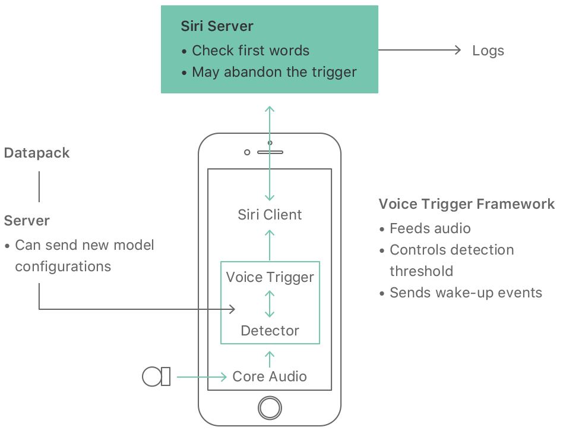
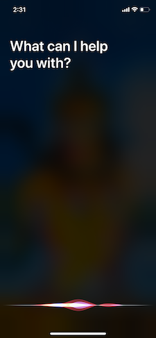
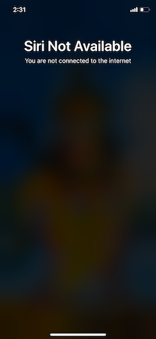

# How do voice assistants activate when we say the command like “ok google”?  
  

  
I have an iPhone, so I said, "Hey Siri" it woke up and asked, "What do you want?"...   
  

  
I felt like "amma ni, silent ga anni vinestundhi ayithey..."  
  
I turned off Wifi and said, "Hey Siri"..., it woke up and said you are not connected to the internet.  
  

So the recognition of speech happens in the device itself.  
  
. . .  
  
Now, I want you to understand a few things before...  
How is the sound from the microphone taken as input? I wanted to show you the sound waveform, so I searched for tools...  
  
I found these collections of [audio editing tools](https://www.musicianonamission.com/best-free-audio-editor/). I want a WebApp. Instead of downloading software and installing, you can just use it in the browser...  
   
Found one, but you need to use Chrome or Brave browser: [HYA-WAVE](https://wav.hya.io/#/fx)  
  
First, do these steps
1. Download this [mp3 file](how-does-ok-google-work.mp3).
2. Upload to [HYA-WAVE](https://wav.hya.io/#/fx) WebApp.
3. Play it.
  
What did I do?  
I recorded the audio, played with it and downloaded it. I got this file: [how-does-ok-google-work.wav](how-does-ok-google-work.wav), which is of size 7.7 MB. It's to large file to share, so I want to convert it to mp3. Used this convertor: [https://convertio.co/wav-mp3/](https://convertio.co/wav-mp3/)  
  
I got an [mp3 file](how-does-ok-google-work.mp3) of size 917 KB. Nice reduction. Same sound from 7.7 MB to 917 KB.  

Now I want to share with you how to zoom the sound waveform, so recorded on my laptop. It's a [.mov file](hey-aai-screencast.mov) of size 7.5 MB. Same problem too large to share, so again convert this to .mp4, for two reasons size and format which all platforms(Windows, macOS, Linux) know how to play it. Used this convertor: 
[https://cloudconvert.com/mov-to-mp4/](https://cloudconvert.com/mov-to-mp4/)
After converting, the [.mp4 file](hey-aai-screencast.mp4) is 1.1 MB. Nice reduction same video from 7.5 MB to 1.1 MB. Here I did not reduce the resolution of the movie. Otherwise, I could get a smaller size.  
  
Do these steps:
1. Download [screencast](hey-aai-screencast.mp4) and see how to zoom a sound waveform.
2. Download the [hey-aai.mp3](hey-aai.mp3) file.
3. Upload to [HYA-WAVE](https://wav.hya.io/#/fx) WebApp and see how the amplitude of the sound varies with the loudness of the audio.
4. Zoom the sound waveform and see for yourself.

You can also see the size difference of the [hey-aai.wav file](hey-aai.wav) and the mp3 file. Now you have understood how the sound from the microphone is captured and how it is represented.   
   
Don't worry when you don't understand, you can do these like
+ check the diagrams in the paper.
+ read the introduction and conclusion parts only.

With this attitude, check the diagrams in these article to understand 
+ [How speech is processed](https://towardsdatascience.com/beginners-guide-to-speech-analysis-4690ca7a7c05).  
+ [How "Hey Siri" works?](https://machinelearning.apple.com/2017/10/01/hey-siri.html)  

Now, when your friend comes and says, "Hey Siri", it should not open. But when you say it must open and do what you say.  
  
How can sound recognition be personalized to the owner of the phone?  
  
Read this paper about [Personalized Hey Siri](https://machinelearning.apple.com/2018/04/16/personalized-hey-siri.html)  
  
I hope you enjoyed this...  

I have a few questions for you to ponder?
+ What are these .wav, .mp3, .mov, .mp4 formats? Why are there so many formats? How are these stored in files and streamed in youtube and other services? How are videos streamed in Netflix, Facebook, Youtube & Amazon PrimeVideo different? What are the 144p, 240p, 360p, 480p, 720p... options in youtube. Why did they choose only these numbers, but nothing else?  

+ How do these tools work, like the audio editor, wav to mp3 converter, mov to mp4 converter? How do they sustain to do this? That is, how do they get money by providing these services? How can we build such tools? Like a WebApp to convert the C program to a Python program? Or a WebApp to create meme like this one?  

Whatever questions you got, write them down in a book and try to find out the answers. If you have questions about this, you can reach out to me on WhatsApp.

